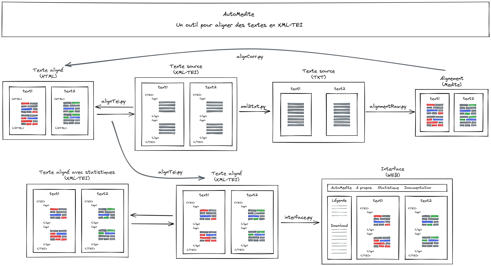

# Introduction

AutoMEDITE est un utilitaire développé en Python 3 approfondissant les résultats obtenus par MEDITE, un logiciel d’alignement textuel comparant automatiquement deux versions d’une même œuvre. Utilisable librement à l'adresse suivante : http://obvil.lip6.fr/medite/,  MEDITE met en évidence les suppressions, insertions, remplacements et les déplacements dans une interface bipartite commode.

Malgré ces qualités incontestables, MEDITE comporte trois limites pour une utilisation scientifique :

1.  L'outil ne supporte pas nativement les standards en édition électronique que ce soit en entrée ou en sortie. Pour les Lettres, on aurait attendu le traitement du XML-TEI et, en ce sens, les résultats ne sont pas interopérables.
2.  Les statistiques ne sont pas pondérées par leurs tailles. La suppression d'un paragraphe entier ou d'un unique mot est par exemple comptabilisé de la même manière dans l'analyse.
3.  Dans certains cas ponctuels, il ajoute des blocs de texte absents des textes sources dans le résultat du texte aligné. Ceci entraîne des difficultés importantes pour les traitements ultérieurs.

AutoMEDITE se propose de répondre à ces limites en ajoutant une interface locale d’édition et de recherche. En ce sens, AutoMEDITE est une surcouche applicative au logiciel MEDITE. Le tableau suivant compare leurs fonctionnalités  :

| Fonctions                                | MEDITE | AutoMEDITE |
|------------------------------------------|--------|------------|
| Exploration de corpus                    | +      | +          |
| Alignement au format brut (TXT)          | +      | +          |
| Alignement au format structuré (XML-TEI) | -      | +          |
| Outil d'édition de texte                 | -      | +          |
| Interface locale                         | -      | +          |
| Statistiques dynamiques                  | -      | +          |
| Code open source                         | -      | +          |

La version proposée au téléchargement est la version 1.1 dont les fonctionnalités sont développées dans la section `Historique des versions`.

# Contenus

Vous souhaitez intégrer AutoMEDITE dans votre projet ? Explorez rapidement vos corpus textuels ? Le code source est disponible au téléchargement à l’adresse suivante :  https://github.com/comesaignol/autoMedite.

Une fois le dossier téléchargé et décompressé, vous obtiendrez la structure suivante :

        autoMedite/
        ├── data/
            ├── alignment-tei/
            ├── alignment-raw/
            ├── corpus-tei/
            ├── alignment-txt/
        ├── docs/
        ├── interface/
            ├── resource/
        ├── media/
        ├── src/
        │README.md
        │requirements.txt

Le répertoire `src` (= source) contient les modules pythons utilisés par autoMedite dont on trouvera ci-dessous une représentation visuelle à haut niveau :

Les modules composant autoMedite s'utilisent successivement de la manière suivante : 

* `xml2txt.py`. Module convertissant les fichiers XML-TEI au format TXT ;
* `alignmentRaw.py`. Module utilisant à distance MEDITE et récupérant les résultats au format HTML ;
* `alignmentCorr.py`. Module de débogage accompagnant l’utilisateur à la correction de l’alignement issu de MEDITE ;
* `alignmentTei.py`. Module transférant les résultats de l’alignement de MEDITE dans les fichiers XML-TEI de départ ;
* `interface.py`. Module générant à partir des fichiers XML-TEI alignés une interface de consultation locale et les données statistiques ;
* `config.py`. Fichier de configuration fournissant pour chacun des modules les chemins relatifs des dossiers ;

La méthode la plus simple pour tester l’interface est de consulter la `demo` déployée au lien suivant : https://comesaignol.github.io/autoMedite/. Vous pouvez également télécharger le répertoire `autoMedite` dans un serveur local configuré avec Apache et PHP. La `demo` pourra alors être consultée à l’adresse suivante :

    http://localhost/autoMedite/docs/index.php

# Installation

De manière générale, AutoMedite nécessite l’installation et la configuration de plusieurs logiciels :

1. Une distribution Python. [Anaconda](https://www.anaconda.com/products/individual) est une solution comportant un environnement de développement adapté appelé Spyder.
2. L’exécutable [GeckoDriver](https://github.com/mozilla/geckodriver/releases) avec modification de la variable `PATH`.
3. Le navigateur web [Mozilla Firefox](https://www.mozilla.org/fr/firefox/new/) qui est une alternative ouverte à Google Chrome.
4. Un serveur local de type Apache + MySQL + PHP. Les solutions prêtes à l’emploi comme [MAMP](https://www.mamp.info/en/downloads/) (pour Mac) ou [WAMP](https://www.wampserver.com/) (pour Windows) sont idéales pour ce type de travail.

Leur installation spécifique sont détaillées dans la section `FAQ` disponible à la fin de cette documentation.

Une fois ces logiciels installés, télécharger le [code source de l'utilitaire](https://github.com/comesaignol/autoMedite) dans le dossier local de votre serveur. À titre d'exemple, le chemin correct sous Windows pour une installation avec WAMP64 est :

    C:\wamp64\www\autoMedite

On installe ensuite les librairies à l'aide de l'IDE Spyder d'Anaconda avec l'utilitaire `pip`. Dans le terminal en bas à droite, on tape la commande suivante :

    pip install -r C:\wamp64\www\autoMedite\requirements.txt

Une fois l'installation de Python faite, on vérifie que [GeckoDriver](https://github.com/mozilla/geckodriver/releases) est bien installé et que la variable `PATH` a été mise à jour en conséquence.

Enfin, on enregistre les fichiers XML-TEI que l'on souhaite aligner dans le répertoire `autoMedite/data/corpus-tei`.

# Utilisation

L'utilitaire autoMedite fonctionne en ligne de commande à l'aide de la commande `python` et de paramètres dédiés.

La première étape est de situer le terminal dans le code-source de l'utilitaire à l'aide de la commande `cd` :

    cd C:\wamp64\www\autoMedite\src

De manière générale, on utilise ensuite la commande `python` pour exécuter le fichier `main.py` accompagné de paramètres :

* `-o` pour `--option`. Le nom du module Python à utiliser sans l'extension `.py`.
* `-t1` pour `--text1`. Le nom du premier texte à aligner  sans l'extension `.xml`.
* `-t2` pour `--text2`. Le second texte à aligner sans l'extension `.xml`.

Les modules de l'utilitaire sont détaillés ci-après.

## xml2txt.py

`xml2txt.py` est un module convertissant les fichiers XML-TEI que l’on souhaite aligner en fichier au formats TXT. Ce sont ces derniers qui seront utilisés pour l’alignement dans MEDITE.

Le module fonctionne à l'aide de la commande suivante :

    python main.py -o "xml2txt" -t1 "1654" -t2 "1878"

En langage naturel, cette commande signifie : « Exécute l'utilitaire autoMedite pour convertir les fichiers XML-TEI au format TXT en choisissant comme premier texte le document 1654 et comme seconde texte le document 1878 ».

Les résultats de la conversion sont alors enregistrés dans le répertoire `autoMedite/data/corpus-txt`.

## alignmentRaw.py

`alignmentRaw.py` est un module utilisant à distance le logiciel MEDITE à l'aide de la librairie Selenium. Il récupère les résultats bruts de l’alignement au format HTML en supprimant une partie des annotations HTML superflus et en séparant les textes dans deux fichiers XML distincts. Il nécessite l’installation du fichier [GeckoDriver](https://github.com/mozilla/geckodriver/releases) à la racine du répertoire et son ajout dans la variable `PATH`.

Dans l’état actuel du développement, `alignmentRaw.py` autorise le passage des quatre principaux paramètres de MEDITE : 

1. `-c` pour `--casse`. Sélectionne le paramètre « Sensible à la casse » ;
2. `-s` pour `--separator`. Sélectionne le paramètre « Sensible aux séparateurs » ;
3. `-d` pour `--diacritique`.  Sélectionne le paramètre « Sensible aux signes diacritiques (éêçè...) » ;
4. `-w` pour `--word`. Sélectionne le paramètre « Algorithme mots (cochée) ou caractères (non cochée) » ;

Par exemple, la commande suivante sélectionne seulement le paramètre « mot » de l'algorithme :

    python main.py -o "alignmentRaw" -t1 "1654" -t2 "1878" -c "False" -s "False" -d "False" -w "True"

Pour modifier les paramètres de l’alignement, il suffit de changer le booléen `False` par `True`.

Les résultats de l’alignement sont alors enregistrés dans le répertoire `autoMedite\data\alignment-raw`.

## alignementCorr.py

`alignmentCorr.py` est un module de débogage accompagnant l’utilisateur à la correction des résultats de l’alignement. En effet, MEDITE ajoute ponctuellement de nouveaux blocs de texte absents des fichiers sources dans les textes alignés. Ces blocs doivent être supprimés manuellement afin d'autoriser le transfert des annotations dans les fichiers XML-TEI de départ.

Le module fonctionne à l'aide de la commande suivante :

    python main.py -o "alignmentCorr" -t1 "1654" -t2 "1878"

Le module génère un fichier `alignmentCorr.tsv`( c'est-à-dire un fichier CSV dont le séparateur est la tabulation) dans le répertoire `autoMedite\data\alignmentRaw`. Le tableau se présente sous la forme de quatre colonnes comportant la liste des tokens pour chacune des versions : les tokens du texte 1 source ; les tokens du texte 1 aligné ; les tokens du texte 2 source ; les tokens du texte 2 aligné.

Le module compare ensuite les listes de tokens entre la version source et la version aligné pour vérifier qu'il n'y a pas de décalage. Dans le cas où un décalage se produit dans la liste des tokens, signe qu’un bloc de texte a été ajouté ou supprimé, une correction manuelle est rendue nécessaire dans les fichiers XML. L'utilitaire signale le token à vérifier dans le tableau à l'aide des lignes de codes suivantes :

    <><><><><><><><><><><><><><><><><><><><><><><><><><><><><><><>
    <><> There is a bug in text2 alignment : check token 11602 <><>
    <><><><><><><><><><><><><><><><><><><><><><><><><><><><><><><>
    
Dans le cas où ce message apparaît, il faut réaliser les étapes suivantes :

1. Ouvrir le fichier `alignmentCorr.tsv`et noter le périmètre du bloc de texte fallacieux à l'aide d.
2. Supprimer ou ajouter ce bloc dans le fichier correspondant de `autoMedite\data\alignmentRaw` en laissant les balises XML-TEI telles qu'elles sont présentes.
3. Exécuter à nouveau le module `alignmentCorr.py` à l'aide de la commande vue précédemment.

L'étape de correction manuelle est terminée lorsque le module affiche le message suivant :

    <><><><><><><><><><><><><>
    <><> There is no bug ! <><>
    <><><><><><><><><><><><><>

Sans cette étape cruciale, l’utilisation des modules suivant prend le risque d’être défectueuse.

## alignmentTei.py

`alignmentTei.py` est un module reportant les résultats de l’alignement de MEDITE présents dans `autoMedite\data\alignment-raw` dans des fichiers XML-TEI. Le processus est rendu possible grâce à une tokenisation des textes qui génère deux types de fichiers :

* Des fichiers XML valide du point de vue de la TEI : les annotations y sont notées à l’aide de balises auto-fermantes.
* Des fichiers XML utiles pour les statistiques : chaque token est noté à l’aide d’une balise dédiée. Le nom de fichier comporte le suffixe `stats`.

Le module fonctionne à l'aide de la commande suivante :

    python main.py -o "alignmentTei" -t1 "1654" -t2 "1878"
    
Les résultats de l'alignement sont enregistrés dans le répertoire `autoMedite\data\alignment-tei`.

## interface.py

`interface.py` est un module générant à partir des fichiers XML-TEI alignés une interface de consultation locale accompagnée de nombreux fichiers statistiques. Cette interface est créée à partir des fichiers PHP, JS, CSS présents dans le répertoire `autoMedite\interface\resource`.

Le module fonctionne à l'aide de la commande suivante :

    python main.py -o "interface" -t1 "1654" -t2 "1878"

L’exécution du module entraîne la création d’une interface indépendante dans le répertoire `autoMedite\interface`. Vous pouvez la consulter en allumant votre serveur Web et en consultant l'URL suivante.

    http://localhost/autoMedite/interface/1654-1878/index.php

Ici, `1654-1878` désigne le nom de l'alignement, il est créé automatiquement à partir des paramètres fournis.

# Historiques des versions

* **7 décembre 2021**. Version 1.1 de l'utilitaire.
* **6 juin 2021**. Publication de la démo.
* **9 avril 2021**. Version 1.0 de l'utilitaire.

Fonctionnalités à venir :

* Gestion des métadonnées disponibles dans les `headers` des fichiers XML-TEI.
* Création d'un module dédié à la création / gestion des statistiques.
* Ajout d'une nouvelle statistique pour calculer le volume de réécriture par personnage, pondéré par leur poids de parole.
* Ajout d'une option pour passer d'un mode de lecture jour / nuit.
* Lister les noms des personnages par ordre alphabétique.
* Harmoniser les scripts Python en appliquant des classes et en supprimant la redondance de portion de codes.
* Correction d'un bug de design sur les couleurs remplacement / déplacement dans les statistiques.
* Rédiger une nouvelle section dans la documentation expliquant comment autoMedite peut être utilisé comme un outil d'édition.

# FAQ

## Comment installer Python ?

Un moyen simple pour installer Python est d'utiliser une distribution Python qui comporte plusieurs utilitaires facilitant son installation et usage.  [Anaconda](https://www.anaconda.com/products/individual) est une solution comportant un environnement de développement adapté appelé Spyder. Pour l'installer :

* Accéder au lien de téléchargement officiel et choisir la version de votre OS ;
* Installer l'exécutable en choissisant une installation dans votre répertoire utilisateur ou non ;

Pour vérifier si Python a été installé, ouvrez un terminal et tapez la commande `python`. L'installation est correcte à partir du moment où la console vous retourne le numéro de version de Python.

## Je suis sous MAC, comment modifier `PATH` ?

Vous trouverez ci-dessous deux tutoriels pour apprendre à modifier `PATH` :

* https://quick-tutoriel.com/ajouter-rapidement-un-nouveau-repertoire-au-path-de-mac-osx/
* https://www.skymac.org/Univers-Apple/article-4eb0d478-Modifier-le-path-de-votre-terminal-sur-macOS.htm

## Python n'est pas reconnu en ligne de commande ?

Si vous tapez la commande `python` dans votre terminal et qu'un message d'erreur apparaît, vous avez deux solutions.

Tout d'abord, désinstaller Anaconda en utilisant l’exécutable `Uninstall-Anaconda3.exe` disponible dans votre répertoire d'installation. Réinstaller ensuite Anaconda à partir du lien de téléchargement officiel.

Ensuite, configurer la variable d'environnement `PATH` de votre système pour qu'elle pointe vers le répertoire d'Installation d'Anaconda. Le procédure à suivre sous Windows est détaillée ci-après :

1. Localiser et copier le chemin du répertoire d'installation d'Anaconda intitulé « anaconda3 ». Il peut être en général situé dans deux endroits : soit à la racine de votre disque dur dans le répertoire « Programmes », soit dans votre dossier utilisateur situé dans `C:\Users\`. Une fois dans le répertoire, afficher son chemin absolu à partir d’un CTR + L.
2. Tapez « Système » dans votre barre de recherche et sélectionner « Système (Panneau de configuration) ». Cliquez ensuite sur le lien « Paramètres avancés du système ».
3. Dans la fenêtre qui s’ouvre, cliquez sur « Variables d'environnement ». Dans la section « Variables système », recherchez la variable d'environnement « PATH » et sélectionnez-la. Cliquez sur « Modifier ». Si la variable d'environnement PATH n'existe pas, cliquez sur « Nouvelle ».
4. Dans la fenêtre « Modifier la variable système » (ou « Nouvelle variable système »), indiquez la valeur de la variable d’environnement PATH en collant le chemin absolu d'Anaconda. Cliquez sur « OK ». Fermez toutes les fenêtres restantes en cliquant sur « OK ».

## Comment installer GeckoDriver ?

GeckoDriver est un utilitaire permettant de faire fonctionner à distance le navigateur WEB Mozilla Firefox. L'installation sous Windows suit les étapes suivantes :

1. Télécharger GeckoDriver à l'adresse suivante : https://github.com/mozilla/geckodriver/releases.
2. Créer un nouveau dossier à la racine de votre répertoire comportant l’exécutable. Copiez ensuite son chemin absolu qui prend généralement la forme suivante : `C:\geckodriver-v0.30.0-win64` (pour Windows).
3. Tapez « Système » dans votre barre de recherche et sélectionner « Système (Panneau de configuration) ». Cliquez ensuite sur le lien « Paramètres avancés du système ».
4. Dans la fenêtre qui s’ouvre, cliquez sur « Variables d'environnement ». Dans la section « Variables système », recherchez la variable d'environnement « PATH » et sélectionnez-la. Cliquez sur « Modifier ». Si la variable d'environnement PATH n'existe pas, cliquez sur « Nouvelle ».
5. Dans la fenêtre « Modifier la variable système » (ou « Nouvelle variable système »), indiquez la valeur de la variable d’environnement PATH en collant le chemin absolu de GeckoDriver. Cliquez sur « OK ». Fermez toutes les fenêtres restantes en cliquant sur « OK ».

## Comment installer un serveur web local ?

On installe généralement un serveur web local à l'aide de solutions tout en un compilant le serveur Web (Apache), la base de données (MySQL) et PHP. On parle alors de serveurs WAMP pour Windows ou de serveur MAMP pour MAC. Leur utilisation est relativement semblable :

1. Télécharger et installer [WAMP](https://www.wampserver.com/) (pour Windows) ou [MAMP](https://www.mamp.info/en/downloads/) (pour Mac) à la racine de votre répertoire.
2. WAMP comporte alors un sous-dossier `www` dans lequel vous allez enregistré vos sites web et interfaces. Dans le cas de MAMP, il s'agit du sous-dossier `htdocs`.
3. Le lancement d'un serveur local se fait en cliquant sur l'icône de l'application. Une nouvelle fenêtre se lance et permet de contrôler que le serveur Web (Apache) et le serveur de bases de données (MySQL) ont bien été lancés.
4. La consultation d'une interface se fait dans un navigateur web via l'URL suivante : `http://localhost/`

Vous trouverez ici un tutoriel vidéo pour l'installation de MAMP : https://www.youtube.com/watch?v=iMhfSrfD2Rg.